# 📊 Python Data Analytics — Job Market Analysis

> A complete end-to-end data analytics project exploring the data job market, with a focused comparison between the **United States** and **India**. Built to answer real-world career questions using Python, Pandas, Matplotlib, and Seaborn.

---

## 📁 Repository Structure

```
python_project_for_job_analysis/
│
├── 1_python_data_project/
│   ├── 0_project_intro.ipynb          ← Market overview & EDA
│   ├── 1_skills_in_demand.ipynb
│   ├── 2_Skills_Trend.ipynb
│   ├── 3_Salary_Analysis.ipynb
│   ├── 4_Optimal_Skills.ipynb
│   └── images/
│
├── 2_basics_notes/
│   ├── 1_python_basics_part1.ipynb
│   ├── 2_python_basics_part2.ipynb
│   └── python_practice.ipynb
│
├── 3_advance_notes/
│   ├── 3_python_advance_part1.ipynb
│   ├── 4_python_advance_part2.ipynb
│   └── python_practice_part2.ipynb
│
├── images/
└── README.md
```

---

## ❓ The Questions

| # | Question |
|---|---|
| 1 | What are the most demanded skills for the top 3 data roles? |
| 2 | How are in-demand skills trending for Data Analysts? |
| 3 | How well do jobs and skills pay for Data Analysts? |
| 4 | What is the most optimal skill to learn? (High Demand + High Pay) |

---

## 🛠️ Tools Used

| Tool | Purpose |
|---|---|
| **Python** | Core language for analysis |
| **Pandas** | Data manipulation & cleaning |
| **Matplotlib** | Base visualizations |
| **Seaborn** | Advanced & styled charts |
| **Jupyter Notebooks** | Interactive development |
| **VS Code** | Code editor |
| **Git & GitHub** | Version control |

---


## 📊 Analysis & Results

---

### 0️⃣ Project Introduction — Market Overview

📓 Notebook: [0_project_intro.ipynb](https://github.com/arnav-is-op/python_project_for_job_analysis/blob/main/1_python_data_project/0_project_intro.ipynb)

Before diving into skills analysis, the first notebook explores the overall landscape of Data Analyst job postings in both the US and India — where the jobs are, which companies are hiring the most, and what the job conditions look like.

---

#### 📍 Job Locations

**🇺🇸 United States**

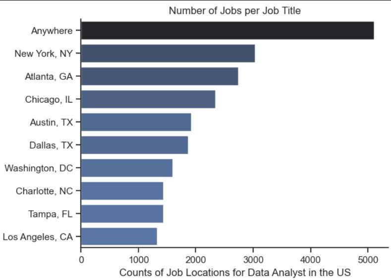

- **"Anywhere"** leads with ~5,100 postings — fully remote roles dominate the US market.
- Among physical locations, **New York, NY** (~3,000) leads, followed by **Atlanta, GA** (~2,800) and **Chicago, IL** (~2,300).
- Other strong markets: **Austin TX**, **Dallas TX**, and **Washington DC**.

**🇮🇳 India**

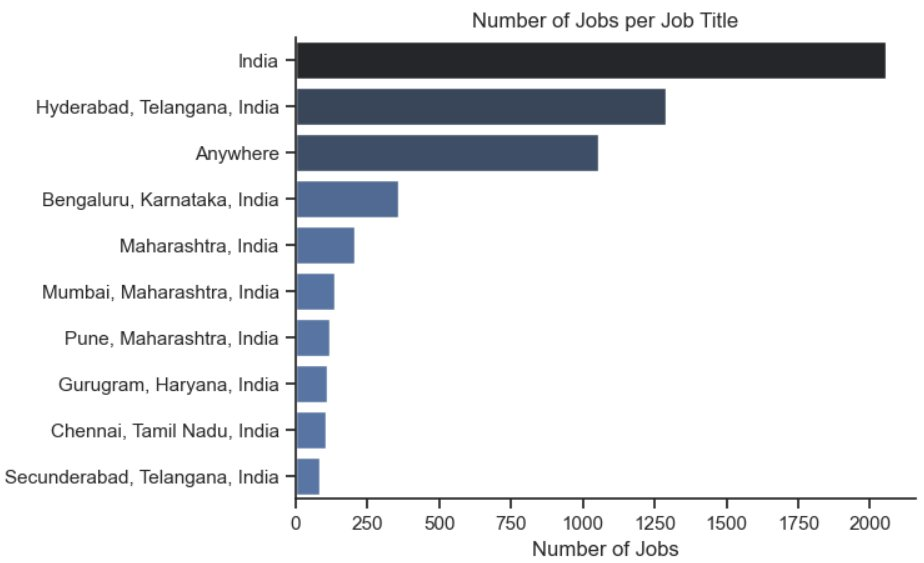

- **India (national/unspecified)** leads at ~2,050 postings.
- **Hyderabad, Telangana** is the clear #1 specific city at ~1,300 postings, followed by remote ("Anywhere") at ~1,050.
- **Bengaluru** (~350), **Mumbai** (~150), and **Pune** (~130) are the next biggest physical hubs.

---

#### 🥧 Job Conditions — WFH, Degree & Health Insurance

**🇺🇸 United States**

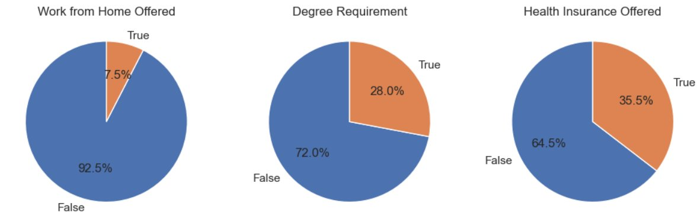

| Condition | Yes | No |
|---|---|---|
| Work from Home | 7.5% | 92.5% |
| Degree Required | 28.0% | 72.0% |
| Health Insurance Offered | 35.5% | 64.5% |

- Most US DA roles are **on-site** (92.5%) despite the remote-first narrative in tech.
- **72% do not require a degree** — great news for self-taught and bootcamp analysts.
- Health insurance is offered in about **1 in 3** postings.

**🇮🇳 India**

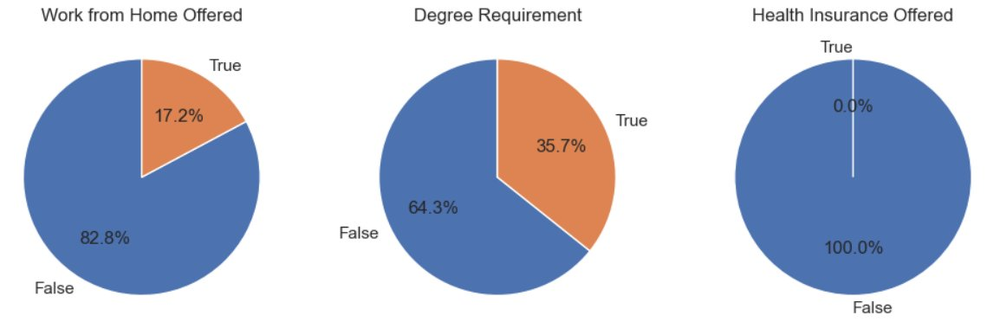

| Condition | Yes | No |
|---|---|---|
| Work from Home | 17.2% | 82.8% |
| Degree Required | 35.7% | 64.3% |
| Health Insurance Offered | 0.0% | 100.0% |

- India offers **more remote flexibility** than the US (17.2% vs 7.5%).
- Degree requirements are slightly higher in India (35.7% vs 28%).
- Health insurance shows 0% in postings — typically bundled into CTC packages rather than listed separately.

---

#### 🏢 Top Hiring Companies

**🇺🇸 United States**

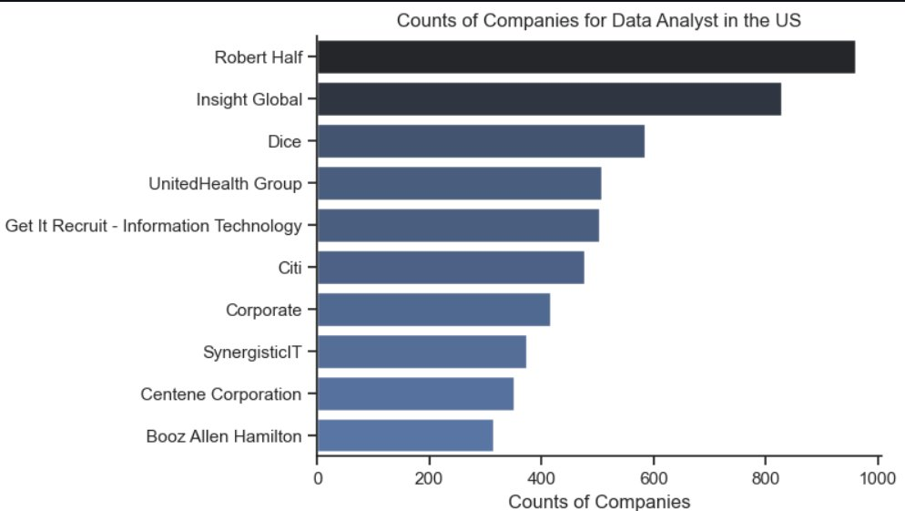

| Rank | Company | Postings |
|---|---|---|
| 1 | Robert Half | ~960 |
| 2 | Insight Global | ~830 |
| 3 | Dice | ~590 |
| 4 | UnitedHealth Group | ~510 |
| 5 | Get It Recruit – IT | ~505 |
| 6 | Citi | ~470 |
| 7 | Corporate | ~420 |
| 8 | SynergisticIT | ~385 |
| 9 | Centene Corporation | ~365 |
| 10 | Booz Allen Hamilton | ~325 |

> The top US hirers are predominantly **staffing and recruiting agencies** (Robert Half, Insight Global, Dice), meaning many postings are contract or third-party placements rather than direct hires.

**🇮🇳 India**

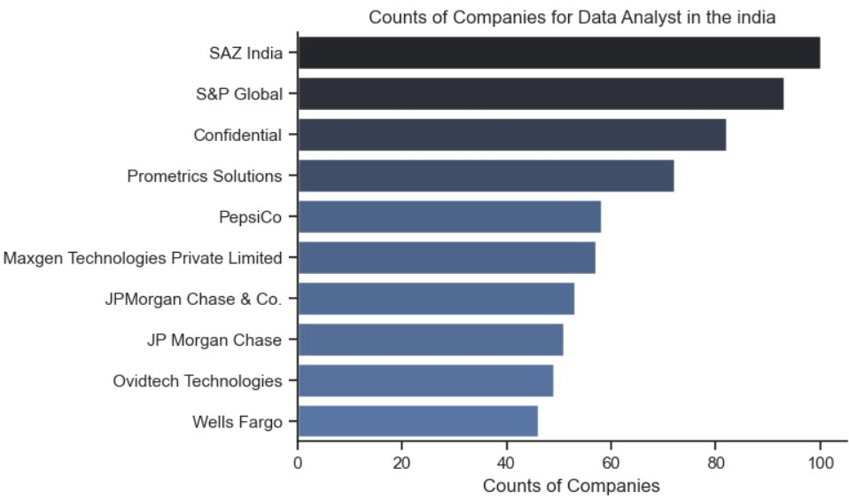

| Rank | Company | Postings |
|---|---|---|
| 1 | SAZ India | ~100 |
| 2 | S&P Global | ~93 |
| 3 | Confidential | ~82 |
| 4 | Prometrics Solutions | ~72 |
| 5 | PepsiCo | ~59 |
| 6 | Maxgen Technologies | ~57 |
| 7 | JPMorgan Chase & Co. | ~53 |
| 8 | JP Morgan Chase | ~51 |
| 9 | Ovidtech Technologies | ~49 |
| 10 | Wells Fargo | ~46 |

> India's top hirers include a mix of **global financial firms** (S&P Global, JPMorgan, Wells Fargo) and **local IT/staffing companies** (SAZ India, Prometrics, Maxgen), reflecting India's strong BFSI and IT services sectors.

---

### 1️⃣ Most Demanded Skills for Top 3 Data Roles

📓 Notebook: [1_skills_in_demand.ipynb](https://github.com/arnav-is-op/python_project_for_job_analysis/blob/main/1_python_data_project/1_skills_in_demand.ipynb)

**Methodology:** Filtered top 3 most popular job titles → calculated skill frequency as a percentage of total job postings → plotted top 5 skills per role.

#### 🇺🇸 United States

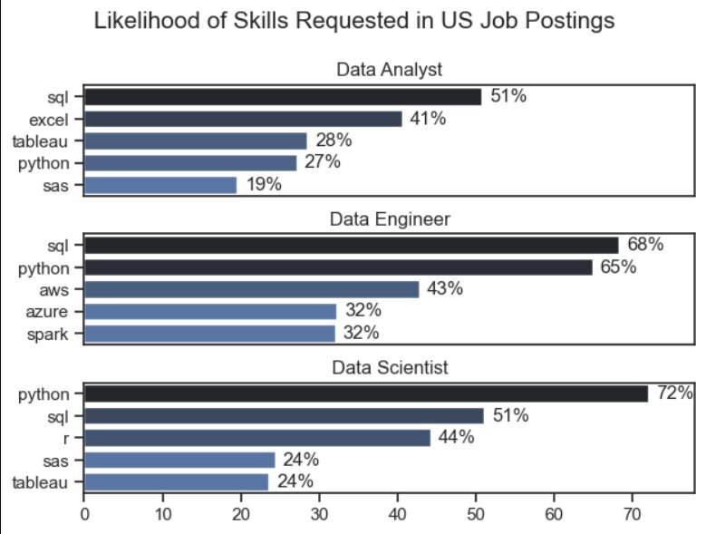

#### 🇮🇳 India

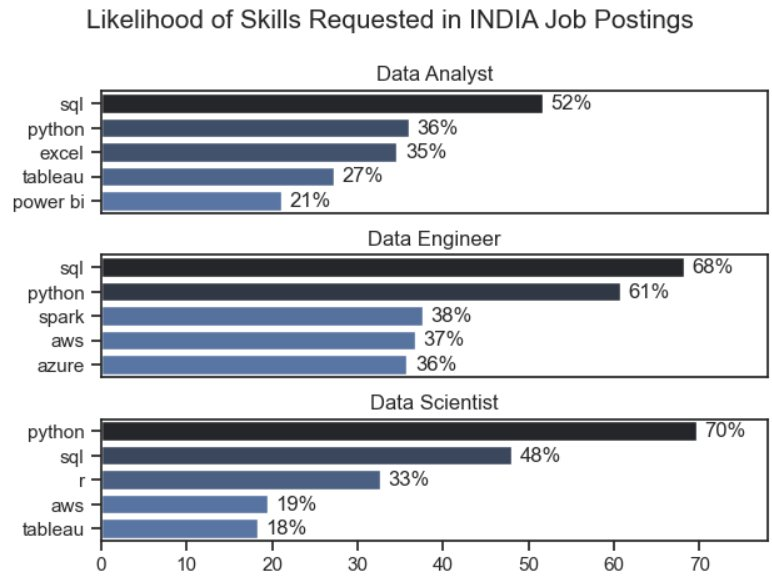

**Key Insights:**
- **SQL dominates both markets** — it's the #1 skill for Data Analysts in both the US (51%) and India (52%).
- **India replaces SAS with Power BI** in the Data Analyst top 5, reflecting stronger Power BI adoption in the Indian market.
- **Python is universally critical** — highest demand for Data Scientists (72% US, 70% India) and Data Engineers (65% US, 61% India).
- **Data Engineers need specialized cloud skills** (AWS, Azure, Spark) while Analysts lean on general tools like Excel and Tableau.

---

### 2️⃣ Trending Skills for Data Analysts (2023)

📓 Notebook: [2_Skills_Trend.ipynb](https://github.com/arnav-is-op/python_project_for_job_analysis/blob/main/1_python_data_project/2_Skills_Trend.ipynb)

**Methodology:** Aggregated skill counts monthly → recalculated as a percentage of total DA job postings each month → plotted monthly trends for top 5 skills.

#### 🇺🇸 United States

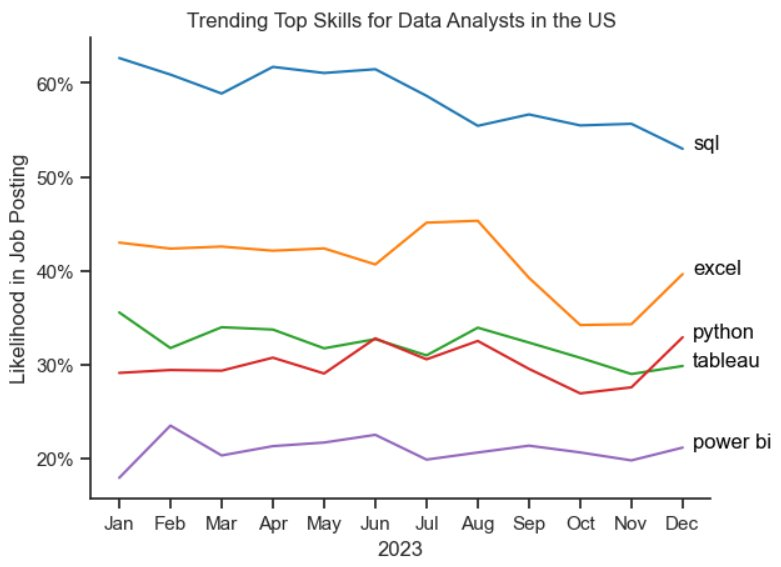

#### 🇮🇳 India

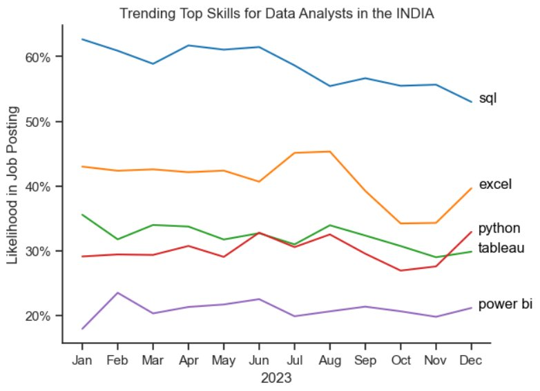

**Key Insights:**
- **SQL is the most consistently demanded skill** all year, though it shows a gradual decline from ~63% to ~55%.
- **Excel surged in Q4**, overtaking Python and Tableau by December — likely tied to year-end reporting cycles.
- **Python and Tableau remain stable** with minor fluctuations, confirming their status as essential baseline skills.
- **Power BI shows a slight upward trend** toward year-end, suggesting growing adoption.

---

### 3️⃣ How Well Do Jobs & Skills Pay?

📓 Notebook: [3_Salary_Analysis.ipynb](https://github.com/arnav-is-op/python_project_for_job_analysis/blob/main/1_python_data_project/3_Salary_Analysis.ipynb)

**Methodology:** Computed median salary for top 6 data job titles → narrowed to Data Analyst roles → found median salary per skill → visualized highest-paying vs. most in-demand skills side by side.

#### 🇺🇸 United States

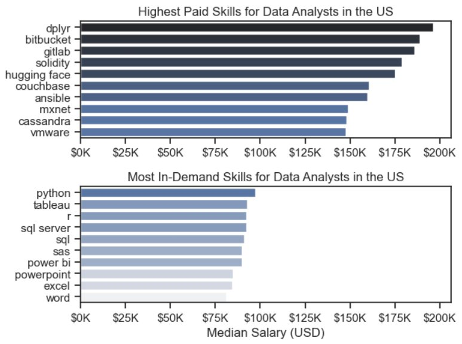

#### 🇮🇳 India


**Key Insights:**
- **Highest-paid skills are niche** — tools like `dplyr`, `Bitbucket`, `GitLab` (US) and `PySpark`, `Linux`, `GitLab` (India) command top salaries up to $200K.
- **Most in-demand skills pay moderately** — `Excel`, `SQL`, `PowerPoint` are the most requested but offer lower median salaries (~$84K–$92K in the US).
- **The takeaway:** Build foundational skills for employability, then layer in specialized skills for salary growth.

---

### 4️⃣ Most Optimal Skills to Learn (High Demand + High Pay)

📓 Notebook: [4_Optimal_Skills.ipynb](https://github.com/arnav-is-op/python_project_for_job_analysis/blob/main/1_python_data_project/4_Optimal_Skills.ipynb)

**Methodology:** Combined skill demand percentage with median salary → plotted as a scatter plot with color-coding by technology category to identify the sweet spot of high demand AND high pay.

#### 🇺🇸 United States

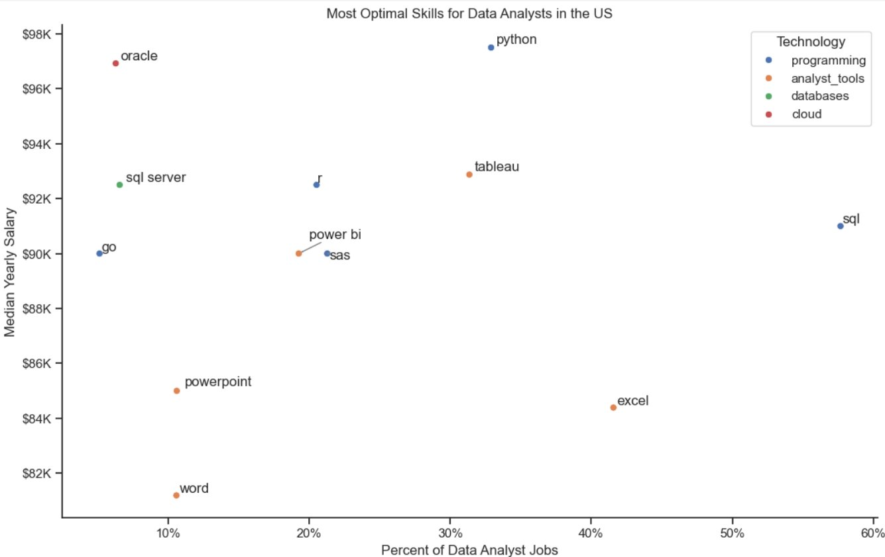

#### 🇮🇳 India

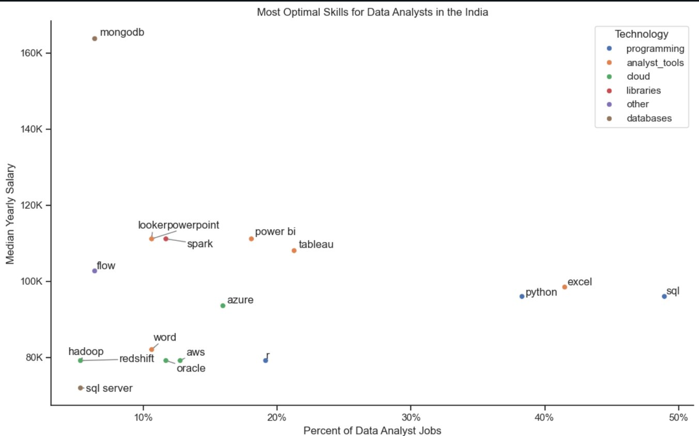

**Key Insights:**
- **Python is the best overall pick** — high salary (~$97K US / ~$96K India) AND high demand (~32% US / ~39% India).
- **SQL is the safest bet** — highest demand in both markets (58% US / 49% India) with solid salaries (~$91K US / ~$96K India).
- **Oracle offers the highest salary** (~$97K US) despite low demand (~5%), making it a valuable niche skill.
- **Tableau and Power BI** offer good demand and decent salaries — ideal for a complete analyst toolkit.
- **Programming skills (blue dots)** consistently cluster at higher salary levels across both markets.

---

## 💡 Conclusions

| Question | Key Takeaway |
|---|---|
| **Market Overview** | Remote roles dominate the US; Hyderabad is India's #1 DA city. ~70% of postings do NOT require a degree. |
| **Most demanded skills** | SQL + Python are non-negotiable across all 3 roles in both countries |
| **Trending skills** | Excel is resurging in Q4; SQL remains king but slowly declining |
| **Best paying skills** | Niche tools (dplyr, PySpark, GitLab) pay more; foundational tools get you hired |
| **Most optimal skill** | **Python** — best balance of demand and salary in both markets |

---

## 📚 What I Learned

- **Advanced Python** — using Pandas, Seaborn, Matplotlib, and `adjustText` for professional-grade analysis and charts
- **Data Cleaning** — handling missing values, parsing list columns, filtering by country
- **Cross-market analysis** — comparing two distinct job markets (US vs. India) using the same analytical framework
- **Strategic thinking** — framing a data analysis project around real career decisions, not just technical exercises

---

## ⚠️ Challenges Faced

- **Data inconsistencies** — required careful cleaning of skill columns stored as stringified lists
- **Label overlaps in scatter plots** — resolved using `adjustText` with custom `expand_points` and `force_text` parameters
- **Balancing breadth vs. depth** — structured the project into focused notebooks per question to keep each analysis clean

---

## 🧠 Python Notes Included

This repo also includes **complete Python learning notes** built alongside the project — from core fundamentals all the way to advanced Pandas and Seaborn.

### 📘 Basics — Part 1 (Core Python)

📓 Notebook: [1_python_basics_part1.ipynb](https://github.com/arnav-is-op/python_project_for_job_analysis/blob/main/2_basics_notes/1_python_basics_part1.ipynb)

| Topic |
|---|
| Data Types & Strings |
| Operators (Part 1 & 2) |
| Conditional Statements |
| Lists, Dictionaries, Sets, Tuples |
| Loops & List Comprehension |
| Functions & Modules |
| Python Standard Library |
| Classes |
| 🔨 Exercise: Skill Investigation |
| 🔨 Exercise: Cleaning Data |

### 📗 Basics — Part 2 (Data Libraries)

📓 Notebook: [2_python_basics_part2.ipynb](https://github.com/arnav-is-op/python_project_for_job_analysis/blob/main/2_basics_notes/2_python_basics_part2.ipynb)

| Topic |
|---|
| NumPy Introduction |
| Pandas Introduction |
| Pandas Data Inspection |
| Pandas Data Cleaning |
| Pandas Data Analysis |
| Matplotlib Introduction, Plotting & Labelling |
| Matplotlib vs Pandas Plotting |
| 🔨 Exercise: Pandas Basics |
| 🔨 Exercise: Matplotlib Basics |

### 📙 Advance — Part 1 (Pandas Deep Dive)

📓 Notebook: [3_python_advance_part1.ipynb](https://github.com/arnav-is-op/python_project_for_job_analysis/blob/main/3_advance_notes/3_python_advance_part1.ipynb)

| Topic |
|---|
| Virtual Environments |
| Pandas: Accessing, Cleaning & Managing Data |
| Pandas: Pivot Tables & Index Management |
| Pandas: Merge, Concat & Exporting Data |
| Pandas: Applying Functions & Explode |
| 🔨 Exercise: Job Demand |
| 🔨 Exercise: Trending Skills |

### 📕 Advance — Part 2 (Visualization Deep Dive)

📓 Notebook: [4_python_advance_part2.ipynb](https://github.com/arnav-is-op/python_project_for_job_analysis/blob/main/3_advance_notes/4_python_advance_part2.ipynb)

| Topic |
|---|
| Matplotlib: Format Charts, Pie Plots, Scatter Plots |
| Matplotlib: Advanced Customization |
| Matplotlib: Histograms & Box Plots |
| Seaborn: Introduction |
| 🔨 Exercise: Skill Pay Analysis |

### 🔁 Practice Files

- [python_practice.ipynb](https://github.com/arnav-is-op/python_project_for_job_analysis/blob/main/2_basics_notes/python_practice.ipynb) — Basics practice exercises
- [python_practice_part2.ipynb](https://github.com/arnav-is-op/python_project_for_job_analysis/blob/main/3_advance_notes/python_practice_part2.ipynb) — Advance practice exercises

---

## Author 
Arnav Heerakar

---
